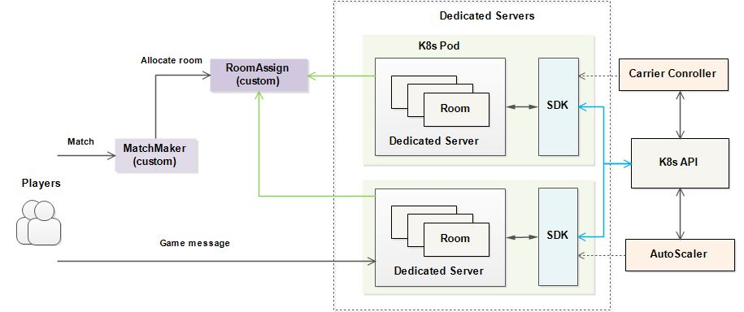

# Carrier

Carrier is a [Kubernetes controller](https://kubernetes.io/docs/concepts/architecture/controller/) for running and scaling [game servers](https://en.wikipedia.org/wiki/Game_server) on [Kubernetes](https://kubernetes.io/).

This project is inspired by [agones](https://github.com/googleforgames/agones).

## Introduction

The online multiplayer games such as competitive [FPS](https://en.wikipedia.org/wiki/First-person_shooter)s, [MMO](https://en.wikipedia.org/wiki/Massively_multiplayer_online_game)s and [MOBA](https://en.wikipedia.org/wiki/Multiplayer_online_battle_arena)s require a [dedicated game server](https://en.wikipedia.org/wiki/Game_server#Dedicated_server)—a full simulation of the game world—for players to connect to as they play within it. 

Dedicated game servers are stateful applications that retain the full game simulation in memory. But unlike other stateful applications, such as databases, they have a short lifetime. Rather than running for months or years, a dedicated game server process will exit when a game is over, which usually lasts a few minutes or hours.

The Kubernetes [Statefulset](https://kubernetes.io/docs/concepts/workloads/controllers/statefulset/) workload does not manage such applications well. Carrier communicates with the game server through the SDK, and dedicated server can notify the Carrier when no player whthin it, then the Carrier can delete the [Pod](https://kubernetes.io/docs/concepts/workloads/pods/) safely. Conversely, when scaling down the Kubernetes cluster, Carrier can also notify the game server through the SDK, which allows the Carrier to better running and scaling the game server.

Here’s an example of a typical dedicated game server architecture based on Carrier.



## Main Features

### Good Scalability

Carrier provides many extensions to communicate with game server and services out of K8s clusters.

- SDK

  communicate with game server directly, which enables game server runtime fetching the `GameServer` status running in K8s, e.g. LB Status, Labels and 
  Annotations.
  
- Webhook(Readiness/Deletable)

  this extension helps user to define when a `GameServer` is ready or can be deleted. Carrier will fetch the `GameServer` status from webhook servers developed 
  by users according to the protocol.

### Scale down GameServers in order

There are many players on different `GameServer`. Since carrier do not allow scaling down a `GameServer` when it is not deletable, carrier should scale down 
the `GameServers` in order to avoid waiting long time. An annotation named `carrier.ocgi.dev/gs-deletion-cost` is used for helping sort the `GameServers`. 
This annotation can be added by `SDK` or set `carrier.ocgi.dev/gs-cost-metrics-name` to enable fetching metrics to set `carrier.ocgi.dev/gs-deletion-cost`. 

### Update Policy

We support some policies to Update `Squad`.

- Recreate
- RollingUpdate
- CanaryUpdate
- InPlaceUpdate

## Quick Start

Build and deploy the Carrier.

### Build

```shell script
# make push
```

### Deploy

```shell script
# kubectl apply -f config/crd.yaml
# kubectl apply -f manifeasts/deploy.yaml
```

## Documentation

You can view the full documentation from the [website](http://ocgi.woa.com:8080).

## License

Carrier is licensed under the Apache License, Version 2.0. See [LICENSE](./LICENSE.md) for the full license text.